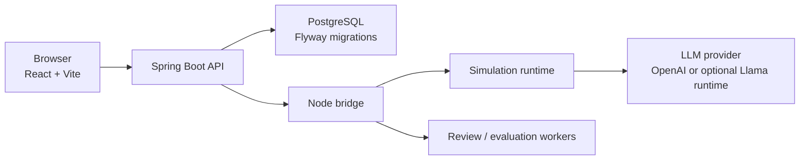

# NPC Simulator

NPC Simulator는 제한된 라운드 안에서 여러 NPC와 대화하고 행동을 선택해
상황의 판세를 바꾸는 대화형 시뮬레이터입니다. 플레이어는 NPC의 반응,
압력 변화, 라운드 상태를 읽고 특정 결말을 유도해야 합니다.

이 저장소는 React + Vite 프론트엔드, Spring Boot 백엔드, Node 기반
시뮬레이션/검수/평가 워커를 함께 담은 모노레포입니다.

## 주요 기능

- 다중 NPC 상호작용 시뮬레이션
- 플레이어 발화, 행동 선택, 타깃 지정 기반의 턴 진행
- NPC 상태, 판세, 라운드 종료 조건 시각화
- Spring Boot API와 Node 런타임 브리지 기반의 시뮬레이션 처리
- OpenAPI 계약 스냅샷과 프론트엔드 타입 연동
- 데이터 검수, 평가, 학습 실행 상태를 확인하는 리뷰 대시보드
- 로컬 실행, 단일 호스트 실행, 프론트엔드/백엔드 분리 배포를 고려한 환경 구성

## 기술 스택

- Frontend: React, Vite, TypeScript
- Backend: Java 21, Spring Boot, Flyway, PostgreSQL
- Runtime Workers: Node.js, TypeScript
- Contracts: OpenAPI, generated TypeScript types
- Optional LLM Runtime: OpenAI API, local/hosted Llama 계열 런타임

## 저장소 구조

```text
frontend/              React + Vite frontend
backend/               Spring Boot API server
backend/scripts/       Node runtime, review, training, evaluation workers
contracts/             OpenAPI contract and generated client types
shared/                shared simulator rules and presentation helpers
docs_public/           public-safe operation/deployment notes
```

## 아키텍처 개요



Spring Boot는 외부 HTTP API, CORS, DB migration, review admin guard, health
check를 담당합니다. Node 워커는 시뮬레이션 런타임, LLM provider 호출,
검수/평가/학습 관련 오케스트레이션을 담당합니다.

프론트엔드는 `VITE_*` 브라우저 공개 설정만 사용합니다. DB 계정, provider
key, admin token, hosted model endpoint 같은 값은 백엔드 또는 배포 플랫폼
secret으로만 주입합니다.

## 로컬 실행

### 준비 사항

- Node.js / npm
- Java 21
- Docker Desktop
- OpenAI API key 또는 Codex CLI 로그인 환경

의존성을 설치합니다.

```bash
npm install
```

공개 템플릿에서 로컬 환경 파일을 만듭니다.

```bash
cp .env.local.example .env
```

실제 API key, DB 비밀번호, hosted endpoint, admin token은 커밋하지 않습니다.
개인 값은 `.env.local`, shell 환경변수, 또는 배포 플랫폼 secret으로 주입합니다.

### 가장 단순한 로컬 실행

로컬/호스팅 Llama final reply 런타임 없이 OpenAI 기반 상호작용만 테스트합니다.

```bash
OPENAI_API_KEY=<your_openai_api_key> \
LLM_PROVIDER_MODE=openai \
FINAL_REPLY_MODE=off \
./run-local-host.sh
```

기본 URL:

- Frontend: `http://localhost:3000`
- Backend: `http://127.0.0.1:8080`
- Health check: `http://127.0.0.1:8080/actuator/health`

### Codex CLI 인증 기반 로컬 실행

OpenAI API key 대신 로컬 Codex CLI 인증을 사용할 수 있습니다.

```bash
codex login

LLM_PROVIDER_MODE=codex \
FINAL_REPLY_MODE=off \
./run-local-host.sh
```

### 백엔드만 실행

```bash
./run-local-host.sh --backend-only
```

PostgreSQL이 이미 실행 중이면:

```bash
./run-local-host.sh --skip-postgres
```

## 리모트 테스트 / 배포 준비

프론트엔드와 백엔드를 분리해서 배포하는 경우 다음 값을 분리해서 설정합니다.

### Frontend

프론트엔드는 브라우저에 노출되는 값만 가져야 합니다.

```bash
VITE_API_BASE_URL=https://api.example.com
VITE_SHOW_INTERACTION_FAILURE_DEBUG=false
```

프론트엔드 환경에는 DB 계정, OpenAI key, RunPod/Baseten key, admin token을
넣지 않습니다.

### Backend

백엔드는 DB, provider secret, runtime path, CORS 정책을 소유합니다.

필수 설정 예시:

```bash
SPRING_PROFILES_ACTIVE=prod
BACKEND_PORT=8080
SPRING_DATASOURCE_URL=jdbc:postgresql://...
SPRING_DATASOURCE_USERNAME=...
SPRING_DATASOURCE_PASSWORD=...
NPC_SIMULATOR_CORS_ALLOWED_ORIGINS=https://app.example.com
NPC_SIMULATOR_DEPLOYMENT_MODE=cloud
LLM_PROVIDER_MODE=openai
OPENAI_API_KEY=...
```

리뷰/학습 실행 같은 admin API는 cloud/prod 환경에서
`NPC_SIMULATOR_ADMIN_TOKEN`이 필요합니다. 이 값은 백엔드 secret으로만
관리하고 프론트엔드에 노출하지 않습니다.

### Smoke check

배포 후 최소 확인 항목:

```bash
curl -fsS https://<APP_DOMAIN>/
curl -fsS https://<API_ORIGIN>/actuator/health
curl -fsS https://<API_ORIGIN>/api/system/info
```

이후 브라우저에서 메인 화면을 열고 한 번의 NPC 상호작용을 실행합니다.

## 개발 검증

```bash
npm run lint
npm run typecheck
npm run build
npm run test:autonomy
npm run test:runtime-contract
```

백엔드 테스트:

```bash
cd backend
./gradlew test
```

API 계약을 변경한 경우:

```bash
npm run generate:openapi-contracts
```

## 공개 저장소 주의사항

이 저장소에는 실제 secret을 포함하지 않습니다.

커밋하면 안 되는 값:

- `.env`, `.env.local`
- API keys
- DB 비밀번호
- SSH key 또는 private server 접속 정보
- hosted model endpoint URL
- hosted model ID
- admin token
- 비용이 발생할 수 있는 provider/runtime 식별자

공개 가능한 운영 문서는 `docs_public/` 아래에 둡니다.

## 참고 문서

- [`docs_public/RUN_LOCAL.md`](docs_public/RUN_LOCAL.md): 로컬 실행 상세
- [`docs_public/ENVIRONMENT.md`](docs_public/ENVIRONMENT.md): 환경변수 책임과 목록
- [`docs_public/DEPLOYMENT_HANDOFF.md`](docs_public/DEPLOYMENT_HANDOFF.md): 배포 준비와 smoke check
- [`contracts/openapi/README.md`](contracts/openapi/README.md): OpenAPI 계약 스냅샷
